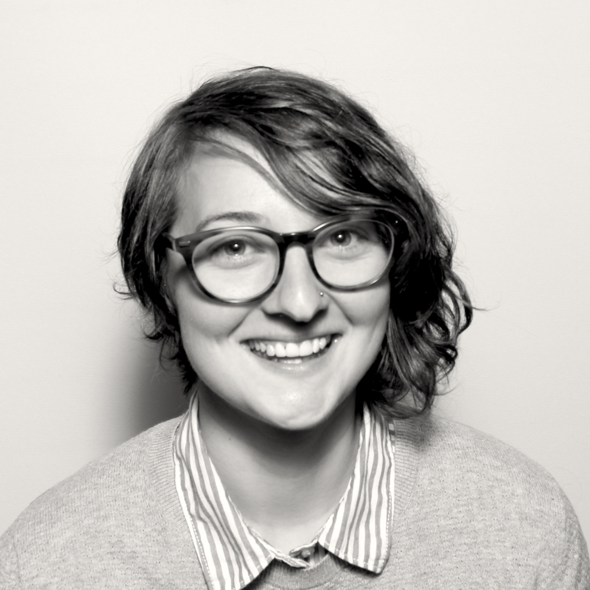

Hello! I'm Noelle, a designer and developer residing in Portland, OR, where I spend my days doing frontend development at [HashiCorp](https://www.hashicorp.com/) and UX at [Hack Oregon](http://www.hackoregon.org/). I'm excited about thoughtful UX/UI design and get a thrill from the challenge of turning chaos into beautiful organization.  

My approach to designing and building UIs is influenced by my varied background. As a software engineer I regularly work within technical constraints, negotiating trade offs and stress cases while prioritizing users needs. My undergraduate degree in sociology equipped me with research methods, systems thinking and a passion for understanding human behavior. I learned to advocate for users and grew to understand deeply technical products as a Community Manager. All of these experiences have led me to a love of UX.

I'm dedicated to building a more empathetic, human-centered tech industry, which I occasionally [speak](http://opensourcebridge.org/sessions/1763), [write](/blog/), and [rant](https://youtu.be/Eg8-tf7VFuQ) (good-naturedly) about. In my free time I organize a weekly community bike ride for women, trans, and non-binary folks. When I'm not on my bike I'm usually running around outside or scheming up my next [travel adventure](https://drive.google.com/open?id=1muxaKlQ9ndnV7dptPwHesS8o89w&usp=sharing).
